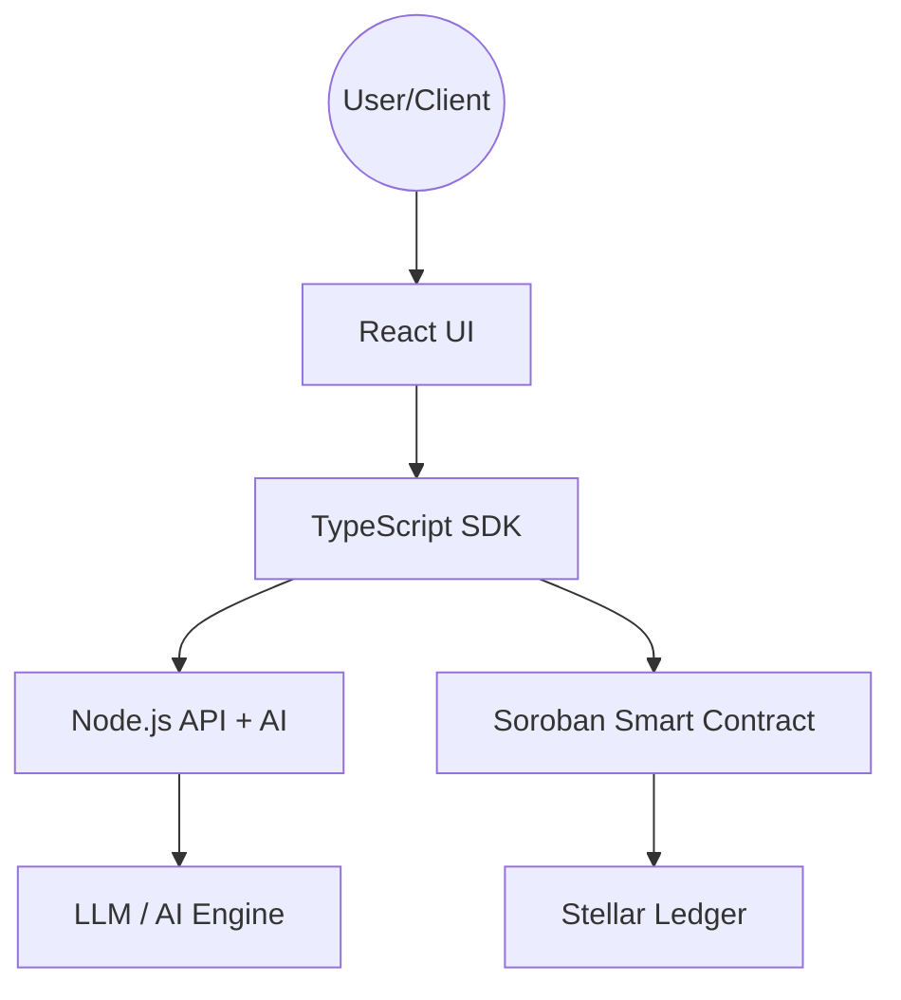

# ✨ Stellar Escrow Protocol

[](https://stellar.org/soroban)
[](LICENSE)
[]()

A state-of-the-art decentralized escrow protocol built on the **Stellar/Soroban** ecosystem, featuring **AI-powered dispute resolution** and natural language escrow creation.

---

## 📖 Table of Contents
- [Core Features](#-core-features)
- [Architecture](#-architecture)
- [Project Structure](#-project-structure)
- [Smart Contract Deep Dive](#-smart-contract-deep-dive)
- [AI Capabilities](#-ai-capabilities)
- [SDK Usage](#-sdk-usage)
- [API Reference](#-api-reference)
- [CLI Management](#-cli-management)
- [Getting Started](#-getting-started)
- [Development Workflow](#-development-workflow)
- [Technical Nuances](#-technical-nuances)
- [Roadmap](#-roadmap)
- [Contributing](#-contributing)
- [License](#-license)

---

## 🚀 Core Features

- **Soroban-Native**: Written in high-performance Rust, leveraging the safety and efficiency of the Soroban smart contract platform.
- **AI Dispute Arbiter**: Automated analysis of evidence text using LLMs to provide resolution recommendations.
- **NLP Escrow Creation**: Just describe the deal in plain English, and our backend will parse it into on-chain parameters.
- **Milestone Protection**: Funds are locked securely and only released when conditions are met or an arbiter intervenes.
- **Permissionless & Transparent**: All escrow states and dispute resolutions are recorded on the Stellar ledger.

---

## 🏗 Architecture

The protocol is divided into four main layers:



### Component Roles:
- **`contracts/escrow-core/`**: The "source of truth". Handles fund locking, state transitions, and authorization.
- **`sdk/`**: A developer-friendly wrapper around the contract interactions, handling XDR serialization and transaction submission.
- **`backend/`**: Serves as the AI bridge. It hosts the NLP parser for creating escrows and the arbiter engine for analyzing disputes.
- **`frontend/`**: A modern React dashboard for users to manage their escrows, raise disputes, and view AI recommendations.

---

## 📂 Project Structure

```text
.
├── backend/                # Node.js Express API
│   ├── src/ai/             # AI Logic (NLP & Arbiter)
│   └── src/routes/         # API Endpoints
├── contracts/
│   └── escrow-core/        # Soroban Rust Contract
│       ├── src/lib.rs      # Main Contract Logic
│       └── src/test.rs     # Unit Tests
├── frontend/               # React + Tailwind Frontend
│   └── src/components/     # UI Components
├── sdk/                    # TypeScript SDK
│   └── src/client.ts       # Main SDK Client
└── docs/                   # Extended Documentation
```

---

## 📜 Smart Contract Deep Dive

### Data Structures

#### `EscrowData`
```rust
pub struct EscrowData {
    pub escrow_id: String,
    pub depositor: Address,
    pub beneficiary: Address,
    pub arbiter: Address,
    pub amount: i128,
    pub token: Address,
    pub expiry_ts: u64,
    pub status: EscrowStatus,
    pub evidence_hash: Option<Bytes>,
}
```

#### `EscrowStatus`
- `Pending`: Escrow created but not yet funded.
- `Funded`: Tokens are locked in the contract.
- `Released`: Funds successfully transferred to the beneficiary.
- `Refunded`: Funds returned to the depositor.
- `Disputed`: A dispute has been raised and is awaiting resolution.
- `Resolved`: Arbiter has settled the dispute.

### Contract API Reference

| Function | Parameters | Description |
|---|---|---|
| `initialize` | `admin: Address` | Sets the contract administrator and initializes storage. |
| `create_escrow` | `params: CreateEscrowParams` | Registers a new escrow. `depositor` must authorize. |
| `fund_escrow` | `escrow_id: String` | Transfers `amount` of `token` from depositor to contract. |
| `release` | `escrow_id, caller` | Releases funds to beneficiary. Callable by `depositor` or `arbiter`. |
| `refund` | `escrow_id` | Returns funds to depositor. Callable by `arbiter`, or anyone if `expiry_ts` passed. |
| `dispute` | `escrow_id, evidence_hash, raised_by` | Transitions status to `Disputed`. Requires `raised_by` auth. |
| `resolve_dispute` | `escrow_id, release_to_beneficiary` | Finalizes a dispute. Only callable by `arbiter`. |

### Events
The contract emits structured events for all major state changes:
```rust
// Example: EscrowDisputed event
#[contractevent]
pub struct EscrowDisputed {
    #[topic]
    pub escrow_id: String,
    pub raised_by: Address,
}
```

---

## 🤖 AI Capabilities

### 1. NLP Parser (`backend/src/ai/nlp.ts`)
Converts raw text descriptions into structured escrow parameters.
- **Input**: "I want to pay Alice 500 USDC for the logo design, due in 10 days."
- **Output**: `{ amount: 500, currency: "USDC", beneficiary: "Alice", expiryDays: 10 }`

### 2. Dispute Arbiter (`backend/src/ai/arbiter.ts`)
Analyses submitted evidence (chat logs, screenshots description, etc.) to recommend a resolution.
- **Logic**: Evaluates keywords like "delivered", "completed", or "fraud" (expandable to real LLM analysis).
- **Result**: Provides a recommendation (`release` | `refund`), confidence score, and detailed reasoning.

> [!TIP]
> To enable real AI logic, set `OPENAI_API_KEY` in `backend/.env` and update the stubs in `backend/src/ai/`.

---

## 📦 SDK Usage

The SDK simplifies interaction with the Soroban contract by handling `ScVal` conversions and transaction preparation.

### Initializing the Client
```typescript
import { EscrowClient } from "@stellar-escrow/sdk";
import { Keypair } from "@stellar/stellar-sdk";

const client = new EscrowClient({
  contractId: "CD...",
  rpcUrl: "https://soroban-testnet.stellar.org",
  networkPassphrase: "Test SDF Network ; September 2015"
}, myKeypair);
```

### Raising a Dispute
```typescript
const evidenceHash = crypto.createHash('sha256').update(evidenceText).digest();
await client.dispute("order-123", evidenceHash, myKeypair.publicKey());
```

---

## 🌐 API Reference

The backend provides endpoints for AI-assisted escrow management.

### Parse Escrow Description
```bash
curl -X POST http://localhost:3001/api/escrow/create-from-text \
  -H "Content-Type: application/json" \
  -d '{"description": "50 XLM for web development in 5 days"}'
```

### Analyse Dispute
```bash
curl -X POST http://localhost:3001/api/dispute/analyse \
  -H "Content-Type: application/json" \
  -d '{"escrowId": "order-123", "evidence": "I delivered the code but haven't received payment."}'
```

---

## ⌨️ CLI Management

You can interact with the contract directly using the `stellar` CLI.

### Initialize Contract
```bash
stellar contract invoke \
  --id CD... \
  --source-account S... \
  --network testnet \
  -- \
  initialize \
  --admin GA...
```

### Get Escrow Details
```bash
stellar contract invoke \
  --id CD... \
  --network testnet \
  -- \
  get_escrow \
  --escrow_id "order-123"
```

---

## 🛠 Getting Started

### Prerequisites
- **Rust**: `rustup target add wasm32-unknown-unknown`
- **Stellar CLI**: [Install Guide](https://developers.stellar.org/docs/build/smart-contracts/getting-started/setup#install-the-stellar-cli)
- **Node.js**: v20+
- **Freighter Wallet**: For frontend interaction.

### Installation

1. **Clone the repo**:
   ```bash
   git clone https://github.com/Escelit/stellar-escrow.git
   cd stellar-escrow
   ```

2. **Install Dependencies**:
   ```bash
   # Root
   npm install
   # Components
   cd backend && npm install && cd ..
   cd frontend && npm install && cd ..
   cd sdk && npm install && cd ..
   ```

---

## 💻 Development Workflow

### Contract Development
```bash
cd contracts/escrow-core
cargo test          # Run unit tests
cargo build --target wasm32-unknown-unknown --release
```

### SDK Integration
```bash
cd sdk
npm run build       # Generate TSDoc and JS bundles
npm test            # Run SDK integration tests
```

### Running the App
1. **Start Backend**: `cd backend && npm run dev`
2. **Start Frontend**: `cd frontend && npm run dev`

---

## 💡 Technical Nuances

### Storage Model
The contract uses **Instance Storage** for high-level metadata (Admin, Escrow Map) to balance performance and cost. Each escrow entry is stored within a `Map` in instance storage, ensuring consistent access times.

### Authorization
Every state-changing function requires `require_auth()` from the appropriate party:
- `create_escrow`: `depositor`
- `fund_escrow`: `depositor`
- `release`: `depositor` or `arbiter`
- `resolve_dispute`: `arbiter`
- `dispute`: `depositor` or `beneficiary`

### Error Codes (Panics)
- `already initialized`: Triggered if `initialize` is called twice.
- `escrow already exists`: Triggered if `escrow_id` is reused.
- `unauthorized`: Triggered if a caller tries to `release` or `resolve` without proper authority.
- `escrow not refundable`: Triggered if `refund` is called before expiry without arbiter approval.

---

## 🗺 Roadmap

- [ ] **Phase 1**: Core Protocol & AI Stubs (Current)
- [ ] **Phase 2**: Full OpenAI Integration & Multi-token support.
- [ ] **Phase 3**: Multi-sig Arbiters & Governance.
- [ ] **Phase 4**: Mainnet Deployment & Mobile Companion App.

---

## 🤝 Contributing

We welcome contributions! Please see [CONTRIBUTING.md](CONTRIBUTING.md) for guidelines on how to get started.

## ⚖️ License

Distributed under the MIT License. See `LICENSE` for more information.

---
<p align="center">Built with ❤️ for the Stellar Ecosystem</p>
