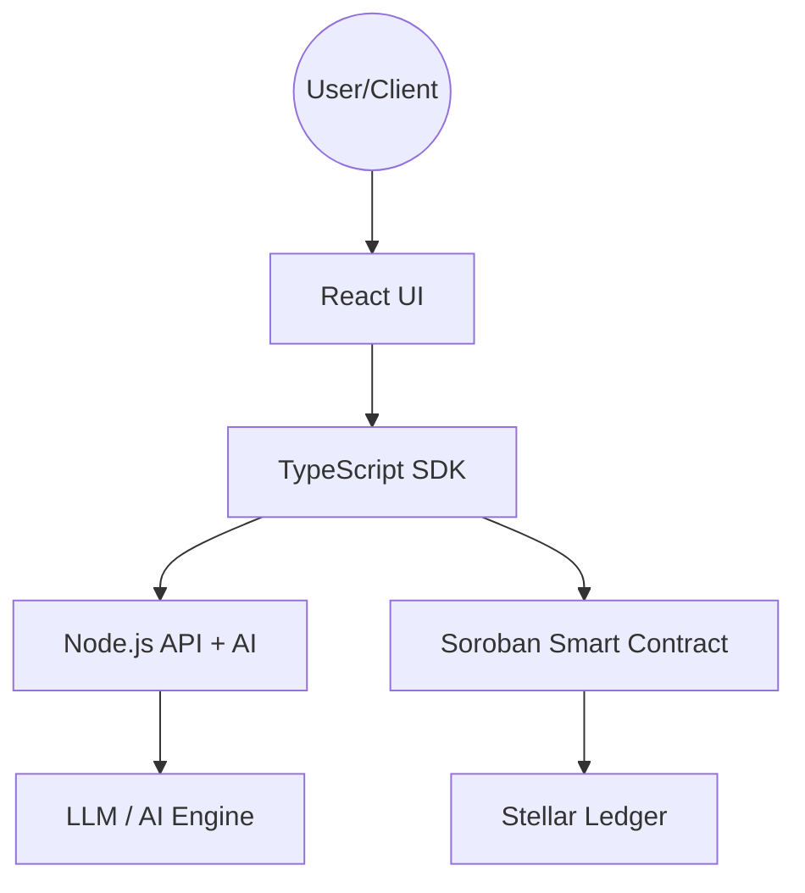

# 🛡️ Stellar Escrow Protocol

<div align="center">


[](https://stellar.org/soroban)
[](https://react.dev)
[](https://www.typescriptlang.org)
[](https://www.rust-lang.org)
[](LICENSE)

**A state-of-the-art decentralized escrow protocol built on the Stellar/Soroban ecosystem, featuring AI-powered dispute resolution and natural language escrow creation.**

[Features](#-core-features) • [The Vision](#-the-vision) • [Architecture](#-architecture) • [Quick Start](#-getting-started) • [API Reference](#-api-reference) • [Contributing](#-contributing)

</div>

---

## 🌟 The Vision

Stellar Escrow Protocol was born to solve a fundamental friction in the digital economy: **Trust**. Traditional escrow services are either centralized, slow, or prohibitively expensive for small-to-medium transactions. By combining the speed and low cost of the **Stellar** network with the analytical power of **Large Language Models (LLMs)**, we provide a friction-free trust layer for the internet.

### Why This Matters:
- **🎯 Bridging the Gap**: Most users find smart contracts intimidating. Our **NLP Parser** allows anyone to create a legally-sound, on-chain escrow using plain English.
- **⚖️ Scalable Justice**: Human arbitration is the bottleneck of decentralized finance. Our **AI Arbiter** provides near-instant analysis of evidence, recommending resolutions with human-level reasoning but at machine speed.
- **🔒 Non-Custodial Trust**: Funds are never held by a third party. They are locked in a Soroban smart contract, ensuring that neither the platform nor the AI can "steal" the funds.

---

## ✨ Core Features

- **⚡ Soroban-Native**: Written in high-performance Rust, leveraging the safety and efficiency of the Soroban smart contract platform.
- **🤖 AI Dispute Arbiter**: Automated analysis of evidence text using LLMs to provide resolution recommendations.
- **✍️ NLP Escrow Creation**: Just describe the deal in plain English, and our backend will parse it into on-chain parameters.
- **🛡️ Milestone Protection**: Funds are locked securely and only released when conditions are met or an arbiter intervenes.
- **🌐 Permissionless & Transparent**: All escrow states and dispute resolutions are recorded on the Stellar ledger.

---

## 🏗 Architecture

The protocol is divided into four main layers:



### Component Roles

| Component | Technology | Role |
|-----------|------------|------|
| **Smart Contract** | Rust + Soroban | The "source of truth". Handles fund locking, state transitions, and authorization. |
| **SDK** | TypeScript | Developer-friendly wrapper around contract interactions and XDR serialization. |
| **Backend** | Node.js + Express | The AI bridge hosting the NLP parser and arbiter reasoning engine. |
| **Frontend** | React + Tailwind | Modern dashboard for escrow management and dispute resolution. |

---

## 📂 Project Structure

```text
.
├── backend/                # Node.js Express API
│   ├── src/ai/             # AI Logic (NLP & Arbiter)
│   └── src/routes/         # API Endpoints
├── contracts/
│   └── escrow-core/        # Soroban Rust Contract
│       ├── src/lib.rs      # Main Contract Logic
│       └── src/test.rs     # Unit Tests
├── frontend/               # React + Tailwind Frontend
│   └── src/components/     # UI Components
├── sdk/                    # TypeScript SDK
│   └── src/client.ts       # Main SDK Client
└── docs/                   # Extended Documentation
```

---

## 📜 Smart Contract Deep Dive

### Data Structures

#### `EscrowData`
```rust
pub struct EscrowData {
    pub escrow_id: String,
    pub depositor: Address,
    pub beneficiary: Address,
    pub arbiter: Address,
    pub amount: i128,
    pub token: Address,
    pub expiry_ts: u64,
    pub status: EscrowStatus,
    pub evidence_hash: Option<Bytes>,
}
```

### Contract API Reference

| Function | Parameters | Description |
|---|---|---|
| `initialize` | `admin: Address` | Sets the contract administrator and initializes storage. |
| `create_escrow` | `params: CreateEscrowParams` | Registers a new escrow. `depositor` must authorize. |
| `fund_escrow` | `escrow_id: String` | Transfers `amount` of `token` from depositor to contract. |
| `release` | `escrow_id, caller` | Releases funds to beneficiary. Callable by `depositor` or `arbiter`. |
| `refund` | `escrow_id` | Returns funds to depositor. Callable by `arbiter`, or anyone if `expiry_ts` passed. |
| `dispute` | `escrow_id, evidence_hash, raised_by` | Transitions status to `Disputed`. Requires `raised_by` auth. |
| `resolve_dispute` | `escrow_id, release_to_beneficiary` | Finalizes a dispute. Only callable by `arbiter`. |

---

## 📦 SDK Usage

The SDK simplifies interaction with the Soroban contract by handling `ScVal` conversions and transaction preparation.

### Initializing the Client
```typescript
import { EscrowClient } from "@stellar-escrow/sdk";
import { Keypair } from "@stellar/stellar-sdk";

const client = new EscrowClient({
  contractId: "CD...",
  rpcUrl: "https://soroban-testnet.stellar.org",
  networkPassphrase: "Test SDF Network ; September 2015"
}, myKeypair);
```

### Raising a Dispute
```typescript
const evidenceHash = crypto.createHash('sha256').update(evidenceText).digest();
await client.dispute("order-123", evidenceHash, myKeypair.publicKey());
```

---

## 🌐 API Reference

The backend provides endpoints for AI-assisted escrow management.

### Parse Escrow Description
```bash
curl -X POST http://localhost:3001/api/escrow/create-from-text \
  -H "Content-Type: application/json" \
  -d '{"description": "50 XLM for web development in 5 days"}'
```

### Analyse Dispute
```bash
curl -X POST http://localhost:3001/api/dispute/analyse \
  -H "Content-Type: application/json" \
  -d '{"escrowId": "order-123", "evidence": "I delivered the code but haven't received payment."}'
```

---

## ⌨️ CLI Management

You can interact with the contract directly using the `stellar` CLI.

### Initialize Contract
```bash
stellar contract invoke \
  --id CD... \
  --source-account S... \
  --network testnet \
  -- \
  initialize \
  --admin GA...
```

### Get Escrow Details
```bash
stellar contract invoke \
  --id CD... \
  --network testnet \
  -- \
  get_escrow \
  --escrow_id "order-123"
```

---

## 🛠 Getting Started

### Prerequisites
- **Rust**: `rustup target add wasm32-unknown-unknown`
- **Stellar CLI**: [Install Guide](https://soroban.stellar.org/docs/getting-started/setup)
- **Node.js**: v20+
- **Freighter Wallet**: [Download](https://www.freighter.app/)

### Installation

1. **Clone the repo**:
   ```bash
   git clone https://github.com/Escelit/stellar-escrow.git
   cd stellar-escrow
   ```

2. **Install Dependencies**:
   ```bash
   npm install
   # Or install individually
   cd backend && npm install
   cd ../frontend && npm install
   cd ../sdk && npm install
   ```

---

## 💡 Technical Nuances

- **Storage Model**: The contract uses **Instance Storage** for high-level metadata (Admin, Escrow Map) to balance performance and cost. Each escrow entry is stored within a `Map` in instance storage, ensuring consistent access times.
- **Authorization**: Every state-changing function requires `require_auth()` from the appropriate party.
- **Error Handling**: Custom panic messages like `already initialized`, `escrow already exists` or `unauthorized` ensure clear failure states.

---

## 🗺 Roadmap

- [ ] **Phase 1**: Core Protocol & AI Stubs (Current)
- [ ] **Phase 2**: Full OpenAI Integration & Multi-token support.
- [ ] **Phase 3**: Multi-sig Arbiters & Governance.
- [ ] **Phase 4**: Mainnet Deployment & Mobile Companion App.

---

## 🤝 Contributing

We welcome contributions! Please see [CONTRIBUTING.md](CONTRIBUTING.md) for guidelines on how to get started.

## ⚖️ License

Distributed under the MIT License. See `LICENSE` for more information.

---
<div align="center">
Built with ❤️ for the Stellar Ecosystem
</div>
